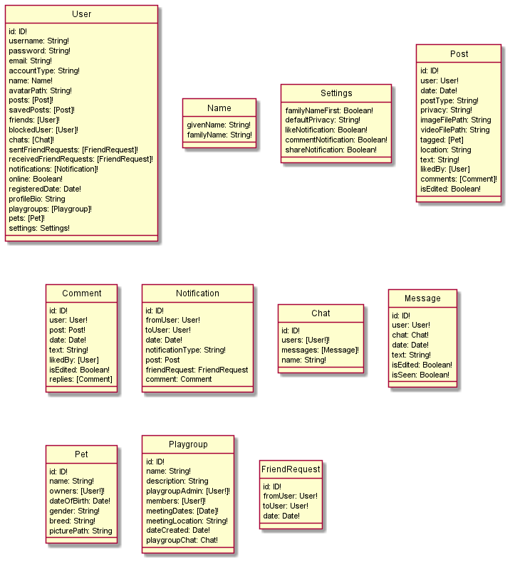

# Pet Social Developer Guide

## Introduction

Pet Social is a web app that will serve as a social media for pet owners, as well as a platform for services like booking Vet appointments and Shopping for pet accessories.

### About this Developer Guide

This developer guide details how Pet Social is designed, implemented and tested.
Readers can find out more about the overall architecture of Pet Social, and also the implementation
behind various functionalities. Technically inclined readers may wish to use the developer guide and
further implement features or customise Pet Social for their own use!

### How to use the Developer Guide

The Developer Guide has been split into clear sections to allow readers to quickly navigate to their desired
information.

- You may navigate to any section from the [Table of contents](#table-of-contents).
- Click [here](#setting-up) for the Setting Up section and get started as a developer!
- Alternatively, if you wish to dive right into Pet Social's implementation,
  we would recommend starting in the [Design](#design) section.

## Table of contents

- [Setting Up](#setting-up)
- [CI/CD Workflow](#cicd-workflow)
  - [Github Workflow](#github-workflow)
  - [Automated Checks](#automated-checks)
- [Design](#design)
  - [Tech Stack](#tech-stack)
  - [Frontend and User Interface](#frontend-and-user-interface)
  - [Server](#server)
  - [Database](#database)
  - [Hosting](#hosting)
- [Implementation](#implementation)
  - [Sign Up and Password Encryption](#sign-up-and-password-encryption)
  - [Sign In and Token Authentication](#sign-in-and-token-authentication)
  - [Arrange Playgroup Meetup](#arrange-playgroup-meetup)
- [Testing](#testing)
  - [Model/Controller Testing](#modelcontroller-testing)
  - [View Testing](#view-testing)
- [Product scope](#product-scope)
  - [Target user profile](#target-user-profile)
  - [Value proposition](#value-proposition)
  - [User stories](#user-stories)
  - [Non-functional requirements](#non-functional-requirements)
- [Glossary](#glossary)

## Setting Up

You may follow this Setting Up guide and get started as a developer! This guide helps you import and set up the development environment for Pet Social onto Visual Studio Code,
but feel free to use your preferred IDE.

1. Ensure you have React and NodeJS installed on your computer.
1. Fork the Pet Social repository from [here](https://github.com/bryanwhl/pet-social).
1. Clone your fork to your local machine, using the Git software you prefer.
1. Open Visual Studio Code; you may download it from [here](https://code.visualstudio.com/). (Or your preferred IDE)
1. On the terminal, run `npm install` in both the root and `/client` directories for missing node modules.
1. On the terminal, in the root directory, run `npm run dev` to start the local development server. In the `/client` directory, run `npm start` to start the web app.
1. A server and development build of the app will run on `localhost:4000` server in your default browser.

Note that API and encryption keys are not hosted on GitHub, hence you will require your own keys in a `.env` file (Which means you cannot interface directly with the Google Maps and password encryption).

This developer guide does not provide detailed instructions on how to use Pet Social. For readers who wish to familiarise themselves with the commands of Pet Social, they can access the [User Guide](https://github.com/bryanwhl/pet-social/blob/main/docs/UserGuide.md).

## CI/CD Workflow

This section details the workflow that we have adopted for the continuous integration and deployment of our application.

### Github Workflow

The central repository that we perform continuous integration on is at the following [github repository](https://github.com/bryanwhl/pet-social). Our Github workflow is as follows:

1. `git pull` the latest changes from the `main` branch of the repository to your local repository
1. Run `npm install` in both the root folder and the client folder of your local repository
1. Create a new branch locally to implement new features or make changes to the codebase
1. Work on the changes, committing your code locally everytime a new feature or change has been implemented using `git add .` and `git commit -m "{commit message}"`
1. After all changes are made, `cd` into the local root folder of the repository and run `npm run test`. Ensure that the test passes before proceeding to step 6
1. Once the test passes, push the code from your local repository to the remote repository using `git push origin {branch name}`
1. Create a Pull request on Github, stating the list of changes that you have made in the Pull request itself
1. Another developer from the team will review your code, providing feedback if necessary
1. If no further updates are required for the pull request, that developer will merge the pull request into the `main` branch
1. Before starting on your next feature, run `git checkout main` to switch to the main branch locally. Run `git pull` to obtain the latest codebase. Repeat step 1

### Automated Checks

Currently, upon every Pull request, two checks will be done automatically on Github:
1. GitGuardian Security check
1. Github Pages check

The GitGuardian Security check will ensure that we have not posted any of our secret API or encryption keys onto GitHub. The GitHub Pages check will ensure that our [GitHub Pages](https://bryanwhl.github.io/pet-social/) continues to work fine upon the Pull request.

## Design

This section describes the architectural and technical design of Pet Social, as well as the connections between them.
The whole tech stack of Pet Social is explained first, before diving into each component.

### Tech Stack

Pet Social is built using the follow technology:

**JavaScript**  
JavaScript is the default language for programming web applications. Pet Social uses JavaScript libraries for both the frontend and backend of the program.

**Node.js** 
Node.js is a server-side runtime environment that helps to ease the job of developing applications in JavaScript. Pet Social uses Node.js and its in-built package manager, Node Package Manager (npm), extensively to increase development efficiency.

**React** 
React is a modern JavaScript library used for building user interfaces. Applications built with React are single-page applications that works inside a browser and does not require page reloading during use. We chose react for the ease of development that it provides for us. We also chose to use the Material-UI framework which contains pre-built react components based on Google's material design.

**Express.js** 
Express.js is a Node.js framework that handles the backend of the application. It is used to ease the development of our backend system.

**GraphQL** 
Pet Social uses GraphQL to define our backend APIs. GraphQL is chosen for its efficiency in dealing with large amounts of data. GraphQL is also optimized for querying as only a single request is needed to retrieve all the information we need.

**Apollo Client** 
Apollo Client is a comprehensive state management library for JavaScript that enables us to manage both local and remote data with GraphQL. Apollo Client greatly eases the development process for writing and handling of GraphQL APIs.

**MongoDB** 
To complete our application, MongoDB is the database that we've chosen due to its NoSQL property. Upon research, MongoDB is a better choice than SQL languages due to its faster querying times for social media features like retrieving posts, friends, comments etc.

### Frontend and User Interface

The diagram below shows the component tree of our React frontend application. These components come together to provide a smooth application interface for users to use our application at ease.

Many of the components are made from sub-components taken from the Material-UI library. These components are made from Google's material design, with visuals and experiences that epitomizes modern web applications.

### Server

The server for Pet Social is implemented using Express.js as a router and GraphQL with Apollo client as the query language to handle queries between the front and back end.

Express is used as a router as middleware that defines the application's endpoints and corresponds to HTTP methods.

GraphQL was chosen over the 'standard' REST API as data can be gathered more precisely using a single query, instead of accessing multiple endpoints. This would minimise overfetching of data.

Apollo Client organises and simplifies the implementation of GraphQL by tracking the schema in a central registry and combining APIs, databases and microservices into a single data graph that can be queried with GraphQL.

You may use _GraphQL Playground_ to make queries to the server by adding `/graphql` to the end of the web address.

### Database

All data except for media (picture and video files are stored on the AWS server) are stored on a MongoDB Atlas cloud database. The `mongoose` node package is used to model the application data and simplifies interactions with the database. The data model follows the data schema used by the server.

This diagram shows our data schema with connections shown explicitly.

This diagram shows our data schema without connections shown explicitly.

### Hosting

Pet Social is being hosted on Amazon Web Services. It is hosted on an EC2 instance with the repository being housed on Amazon Web Services' Ubuntu Server. The backend of Pet Social is hosted using the pm2 package. All images are hosted on the /images route that is being run as a static folder.

## Implementation

This subsection provides sequence and activity diagrams detailing the workflows for more complicated processes in Pet Social.

### Sign Up and Password Encryption

When the user signs up for a new account, a validity check is done to ensure a unique email and username are used.

Subsequently, the password is encrypted using the password-hashing function `bcrypt`. It is hashed through a predetermined number of "salt rounds" or cost factors. A higher cost factor uses more time to calculate a single `bcrypt` hash but makes the encrypted password more difficult to brute-force. 10 salt rounds were chosen to balance speed and security.

This encrypted password is sent and stored on the database.

### Sign In and Token Authentication

This sequence diagrams shows the execution flow of the program when a user signs in to the app.

Every time a user logs in, a token will be generated and saved to the browser's `sessionStorage`. Each query for `currentUserQuery` will verify the validity of this token. If the token is invalidated or deleted, the user would be logged out.

If 'Remember Me' is selected during sign in, the token will be saved to the browser's `localStorage`. Upon reloading the application, this token will be retrieved and verified for automatic sign in. If no valid token is present, the original sign in screen is rendered. `localStorage` is cleared when the user logs out.

### Arrange Playgroup Meetup

A Playgroup is a pet gathering event with a specified location and time. It is a new concept that we have designed for pet owners to organize a meeting in-person for them to socialize with other pet owners.

Playgroup Meetups can be organized on the Playgroup tab of the website. The meetup date is set by the organizer, and anyone from the public who is free and keen to join can simply click the "Join" button on the playgroup marker located on the google map interface. Eventually, functionalities will be implemented in the playgroup system for members of the playgroup to suggest meetup dates and communicate with each other through a Group Chat function.

## Testing

Our application follows the Model-View-Controller(MVC) model. The model being the MongoDB Database, the view being the User Interface, and the controller being the frontend logic with React states and backend logic with Apollo Client and Mongoose.

We divided our testing into two sections: Model and Controller Testing, as well as View testing.

Model/Controller Testing is conducted with mock data and unit tests on our database and server to test application logic and flow. It is a form of integration testing between the server and database.

View testing is done with hands on user interaction, gathering feedback on UI usability and functionality. It is a form of unit testing of the frontend as well as acceptance testing of the features.

### Model/Controller Testing

The backend model/controller testing is done with Jest - a JavaScript Testing Framework that provides simple and detailed testing functionality and exception handling.

The `supertest` npm package is used along with Jest to help us write tests for testing GraphQL requests.

The primary purpose to use Jest is to test our /graphql endpoint to ensure that the server is returning the correct data when given a query. To do this, we populated our database with sample data that will be tested.

Some of the functionalities that our test cases check for are as follows:

1. No duplication in usernames in our database allowed, else error code 400 is returned from the server
1. '@' symbol is required for all e-mail fields when signing up, else error code 400 is returned from the server
1. Database is returning results as intended when a users fetching query is called

Tests are run with the `npm run test` script in the root directory. The tests verify the expected response codes and data (successful request) or error messages (unsuccessful request) are actually returned from the database and server. When it does not, Jest provides detailed and contextual error messages to pinpoint the nature of the error easily.

The picture above shows a screenshot of the latest test run using the `npm run test` command.

The test scripts are found in the `_tests_` folder in `graphqlTest.js`.

This form of integration testing ensures the interactions and functions between the server and database run as intended. These tests are run before each pull request to minimise code regression. Any changes that affect the interactions between the server and database can be quickly identified and fixed.

### View Testing

Two types of testing are done for the "View" element of our application: Jest testing and hands-on user testing. 

For the Jest testing portion, we concentrate on testing utility functions that are used for the frontend of the application. These utility functions include:

1. `convertDate()` function: Converting unix value to datetime value,
2. `displayName()` function: Displaying the user's family name and given name in the correct order as customized by the user in his/her settings page

The frontend view testing is also done with hands on user testing on a high-fidelity artifact - a working prototype of the application.

For milestone 2, the link to the live deployment of the application is sent with a user feedback form to a large pool of users. This large-scale testing includes both pet owners and non-pet owners with a focus on usability and user experience. The feedback is collected on a [Google Form](https://forms.gle/KHhQLmau7aoJbxTH8), with two parts to the form: a semi-guided section which asks the tester to perform an action without explicit instructions on how to perform it, followed by independent testing where the user can refer to the comprehensive [User Guide](https://github.com/bryanwhl/pet-social/blob/main/docs/UserGuide.md) and spend time to evaluate the overall function and intuitivity of the application. The testers are asked to rate ease of use as well as report any bugs.

For milestone 3, the live deployment will be sent with another feedback form. However, this round of user feedback would be more targeted - focusing on actual pet owners for acceptance testing, evaluating if the application and its features meet the needs and requirements of the end users.

## Product scope

Product scope provides you an insight into the value of Pet Social, and its benefits for target users.

### Target user profile:

- Pet owners who:

  - want to interact with other pet users and pets
  - want to arrange meetups with other pet owners
  - want to purchase items and services for their pets

- Business owners who:
  - want to advertise their products or services to pet owners
  - want to sell their products or services to pet owners

### Value proposition

There is currently no easy way to do these besides meeting other pet owners from our own social circle. Apart from Facebook groups, there are no centralised digital platforms for pet owners to interact, socialise or advise each other on pet ownership.

Pet Social will be the first to implement such features in an integrated application; one that connects pet owners and that enhances their experience as pet owners.

### User Stories

| Version | As a ...              | I want to ...                                      | So that I can ...                                    |
| ------- | --------------------- | -------------------------------------------------- | ---------------------------------------------------- |
| v1.0    | Pet Social User       | create a personal or business account              | begin using the platform                             |
| v1.0    | Pet Social User       | delete my account                                  | remove my data if I no longer use the platform       |
| v1.0    | Pet Social User       | post photos                                        | share my experiences and memories with my pets       |
| v1.0    | Pet Social User       | comment on posts                                   | reply to posts that I enjoy                          |
| v2.0    | Pet Owner             | add other users as friends                         | connect more easily with each other on the platform  |
| v2.0    | Pet Social User       | chat with other users on the platform              | easily communicate without leaving Pet Social        |
| v2.0    | Pet Social User       | view notifications                                 | quickly see events pertaining to me                  |
| v2.0    | Pet Owner             | form playgroups with fellow pet owners             | our pets can play together                           |
| v3.0    | Pet Services Provider | join the platform                                  | advertise and sell my products and services          |
| v3.0    | Pet Services Provider | advertise my products and services                 | I can market my products to bigger audiences         |
| v3.0    | Pet Social User       | adjust UI settings such as font size and dark mode | configure my experience to my preferences            |
| v3.0    | Pet owner             | have friend suggestions                            | connect with others who have similar interests as me |

### Non-Functional Requirements

1. The application should work on any _mainstream_ browser (e.g. Chrome, Firefox, Edge)
1. The application should be responsive - users should be able to use the app and interact intuitively with the UI with different devices and browser configurations.

## Glossary

- _Playgroup_ - Groups where users may join to arrange or participate in meet ups.
- _IDE_ - Integrated development environment, software applications for software development
