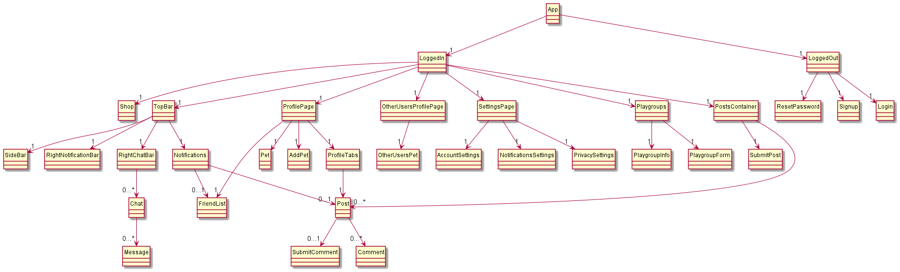

# Developer Guide

## Introduction

```
Pet Social
```

Pet Social is a web app that will serve as a social media for pet owners, as well as a platform for services like booking Vet appointments and Shopping for pet accessories.

### About this Developer Guide

This developer guide details how Pet Social is designed, implemented and tested.
Readers can find out more about the overall architecture of Pet Social, and also the implementation
behind various functionalities. Technically inclined readers may wish to use the developer guide and
further implement features or customise Pet Social for their own use!

### How to use the Developer Guide

The Developer Guide has been split into clear sections to allow readers to quickly navigate to their desired
information.

- You may navigate to any section from the [Table of contents](#table-of-contents).
- Click [here](#setting-up) for the Setting Up section and get started as a developer!
- Alternatively, if you wish to dive right into Pet Social's implementation,
  we would recommend starting in the [Design](#design) section.

<div style="page-break-after: always;"></div>

## Table of contents

- [Setting Up](#setting-up)
- [Design](#design)
  - [Tech Stack](#tech-stack)
  - [Frontend and User Interface](#frontend-and-user-interface)
  - [Server](#server)
  - [Database](#database)
  - [Hosting](#hosting)
- [Implementation](#implementation)

- [Product scope](#product-scope)
  - [Target user profile](#target-user-profile)
  - [Value proposition](#value-proposition)
  - [User stories](#user-stories)
  - [Non-functional requirements](#non-functional-requirements)
- [Glossary](#glossary)

<div style="page-break-after: always;"></div>

## Setting Up

You may follow this Setting Up guide and get started as a developer! This guide helps you import and set up the development environment for Pet Social onto Visual Studio Code,
but feel free to use your preferred IDE.

1. Ensure you have React and NodeJS installed on your computer.
1. Fork the Pet Social repository from [here](https://github.com/bryanwhl/pet-social).
1. Clone your fork to your local machine, using the Git software you prefer.
1. Open Visual Studio Code; you may download it from [here](https://code.visualstudio.com/) first.
1. On the terminal, run `npm install` for missing node modules.
1. In the root directory, run `npm run dev` to start the local development server. In the `/client` directory, run `npm start` to start the web app.

For readers who are not familiar with the commands of Pet Social, they can access the User Guide (Coming Soon).

<div style="page-break-after: always;"></div>

## Design

This section describes the architectural design of Pet Social, as well as the connections between them.
The overall tech stack of Pet Social is explained first, before diving into each of the architecture components.

### Tech Stack

Pet Social is built using the follow technology:

**JavaScript** <br />
JavaScript is the default language for programming web applications. Pet Social uses JavaScript libraries for both the frontend and backend of the program.

**Node.js**<br />
Node.js is a server-side runtime environment that helps to ease the job of developing applications in JavaScript. Pet Social uses Node.js and its in-built package manager, Node Package Manager (npm), extensively to increase development efficiency.

**React**<br />
React is a modern JavaScript library used for building user interfaces. Applications built with React are single-page applications that works inside a browser and does not require page reloading during use. We chose react for the ease of development that it provides for us. We also chose to use the Material-UI framework which contains pre-built react components based on Google's material design.

**Express.js**<br />
Express.js is a Node.js framework that handles the backend of the application. It is used to ease the development of our backend system.

**GraphQL**<br />
Pet Social uses GraphQL to define our backend APIs. GraphQL is chosen for its efficiency in dealing with large amounts of data. GraphQL is also optimized for querying as only a single request is needed to retrieve all the information we need.

**Apollo Client**<br />
Apollo Client is a comprehensive state management library for JavaScript that enables us to manage both local and remote data with GraphQL. Apollo Client greatly eases the development process for writing and handling of GraphQL APIs.

**MongoDB**<br />
To complete our application, MongoDB is the database that we've chosen due to its NoSQL property. Upon research, MongoDB is a better choice than SQL languages due to its faster querying times for social media features like retrieving posts, friends, comments etc.

### Frontend and User Interface

The diagram below shows the component tree of our React frontend application. These components come together to provide a smooth application interface for users to use our application at ease.



Many of the components are made from sub-components taken from the Material-UI library. These components are made from Google's material design, with visuals and experiences that epitomizes modern web applications.

### Server

We implemented our server using Express.js as a router and GraphQL with Apollo client as the query language to handle queries between the front and back end.

Express is used as a router as middleware that defines the application's endpoints and corresponds to HTTP methods.

GraphQL was chosen over the 'standard' REST API as data can be gathered more precisely using a single query, instead of accessing multiple endpoints. This would minimise overfetching of data.

Apollo Client organises and simplifies the implementation of GraphQL by tracking the schema in a central registry and combining APIs, databases and microservices into a single data graph that can be queried with GraphQL.

You may use _GraphQL Playground_ to make queries to the server by adding `/graphql` to the end of the web address.

### Database

This diagram shows our data schema with connections shown explicitly.


This diagram shows our data schema without connections shown explicitly.


### Hosting

Pet Social is being hosted on Amazon Web Services. It is hosted on an EC2 instance with the repository being housed on Amazon Web Services' Ubuntu Server. The backend of Pet Social is hosted using the pm2 package. All images are hosted on the /images route that is being run as a static folder.

## Implementation

This subsection provides activity diagrams detailing the workflows for more complicated processes in Pet Social.

### Arrange Playgroup Meetup


Playgroup Meetups can be suggested on the Playgroup. Upon agreement among the members, the meetup date is set. Else, new dates are suggested.

## Product scope

Product scope provides you an insight into the value of Pet Social, and its benefits for target users.

### Target user profile:

- Pet owners who:
  - want to interact with other pet users and pets
  - want to purchase items and services for their pets

### Value proposition

There is currently no easy way to do this besides meeting other pet owners from our own social circle. Furthermore, apart from Facebook groups, there are no centralised digital platforms for pet owners to interact, socialize or advise one another on pet ownership.

Pet Social will be the first to conceptualise such an application; one that connects pet owners nearby in ways that will enhance their experience as pet owners.

### User Stories

| Version | As a ...              | I want to ...                          | So that I can ...                           |
| ------- | --------------------- | -------------------------------------- | ------------------------------------------- |
| v1.0    | Pet Owner             | create an account                      | begin using the platform                    |
| v2.0    | Pet Owner             | form playgroups with fellow pet owners | our pets can play together                  |
| v3.0    | Pet Services Provider | join the platform                      | advertise and sell my products and services |

### Non-Functional Requirements

1. The application should work on any _mainstream_ browser (e.g. Chrome, Firefox, Edge)
1. The application should be responsive - users should be able to use the app with different devices and browser configurations.

<div style="page-break-after: always;"></div>

## Glossary

- _Playgroup_ - Groups where users may join to arrange or participate in meet ups.
- _IDE_ - Integrated development environment, software applications for software development
