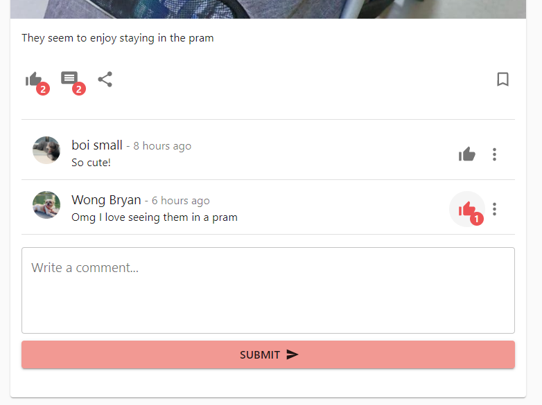

# Pet Social User Guide

 

## Introduction

Pet Social is a web app that will serve as a social media for pet owners, as well as a platform for services like booking Vet appointments and Shopping for pet accessories.

 

## About the User Guide

Welcome to the User Guide for Pet Social!

This user guide helps you to get started with Pet Social by providing you with extensive information about the application. In this user guide, we explain all the features and functionalities of Pet Social, allowing you to familiarise yourself with the application.

## How to use the User Guide

Here are four main features of the User Guide:

- You may navigate to any subsection from the [Table of Contents](#table-of-contents).
- Scroll down or click [here](#1-quick-start) for the Quick Start guide to get started with Pet Social.
- The [Features](#2-features) section will run you through all the commands that are available in Pet Social.
- [FAQ](#3-faq) and [Feature Summary](#4-feature-summary) are available for quick queries or reference.

### Legend

A short description of the icons that are used in this User Guide.

| Icon      | Purpose                         |
| --------- | ------------------------------- |
| :warning: | Warnings on usage of Pet Social |
| :bulb:    | Tips for Users                  |

## Table of contents

1. [Quick start](#1-quick-start)  

2. [Features](#2-features)  
   2.1 [Account](#21-account)  
   &nbsp;&nbsp;&nbsp;&nbsp; 2.1.1 [Creating an Account](#211-creating-an-account)  
   &nbsp;&nbsp;&nbsp;&nbsp; 2.1.2 [Sign in to Account](#212-sign-in-to-account)  
   &nbsp;&nbsp;&nbsp;&nbsp; 2.1.3 [Changing your Email](#213-changing-your-email)  
   &nbsp;&nbsp;&nbsp;&nbsp; 2.1.4 [Changing your Password](#214-changing-your-password)  
   &nbsp;&nbsp;&nbsp;&nbsp; 2.1.5 [Delete your Account](#215-delete-your-account)  
   2.2 [Profile](#22-profile)  
   &nbsp;&nbsp;&nbsp;&nbsp; 2.2.1 [Edit your profile picture](#221-edit-your-profile-picture)  
   &nbsp;&nbsp;&nbsp;&nbsp; 2.2.2 [Edit your profile biography](#222-edit-your-profile-biography)  
   &nbsp;&nbsp;&nbsp;&nbsp; 2.2.3 [Changing your name order](#223-changing-your-name-order)  
   2.3 [Pets](#23-pets)  
   &nbsp;&nbsp;&nbsp;&nbsp; 2.3.1 [Adding a Pet](#231-adding-a-pet)  
   &nbsp;&nbsp;&nbsp;&nbsp; 2.3.2 [Adding Owners](#232-adding-owners)  
   &nbsp;&nbsp;&nbsp;&nbsp; 2.3.3 [Removing Self as Owner](#233-removing-self-as-owner)  
   &nbsp;&nbsp;&nbsp;&nbsp; 2.3.4 [Deleting a Pet](#234-deleting-a-pet)  
   2.4 [Posts](#24-posts)  
   &nbsp;&nbsp;&nbsp;&nbsp; 2.4.1 [Adding a Post](#241-adding-a-post)  
   &nbsp;&nbsp;&nbsp;&nbsp; 2.4.2 [Liking a Post](#242-liking-a-post)  
   &nbsp;&nbsp;&nbsp;&nbsp; 2.4.3 [Sharing a Post (Coming Soon)](#243-sharing-a-post-coming-soon)  
   &nbsp;&nbsp;&nbsp;&nbsp; 2.4.4 [Saving a Post](#244-saving-a-post)  
   &nbsp;&nbsp;&nbsp;&nbsp; 2.4.5 [Commenting on a Post](#245-commenting-on-a-post)  
   &nbsp;&nbsp;&nbsp;&nbsp; 2.4.6 [Liking a Comment](#246-liking-a-comment)  
   &nbsp;&nbsp;&nbsp;&nbsp; 2.4.7 [Replying to a comment (Coming Soon)](#247-replying-to-a-comment-coming-soon)  
   &nbsp;&nbsp;&nbsp;&nbsp; 2.4.8 [Deleting a Comment](#248-deleting-a-comment)  
   &nbsp;&nbsp;&nbsp;&nbsp; 2.4.9 [Deleting a Post](#249-deleting-a-post)  
   &nbsp;&nbsp;&nbsp;&nbsp; 2.4.10 [Receive Notifications from Post (Coming Soon)](#2410-receive-notifications-from-post-coming-soon)  
   &nbsp;&nbsp;&nbsp;&nbsp; 2.4.11 [Hide Posts from User/Block User (Coming Soon)](#2411-hide-posts-from-userblock-user-coming-soon)  
   &nbsp;&nbsp;&nbsp;&nbsp; 2.4.12 [Reporting a Post (Coming Soon)](#2412-reporting-a-post-coming-soon)  
   &nbsp;&nbsp;&nbsp;&nbsp; 2.4.13 [Editing a Post](#2413-editing-a-post)  
   &nbsp;&nbsp;&nbsp;&nbsp; 2.4.14 [Viewing a Tagged Post (Coming Soon)](#2414-viewing-a-tagged-post-coming-soon)  
   2.5 [Friends](#25-friends)  
   &nbsp;&nbsp;&nbsp;&nbsp; 2.5.1 [Sending a Friend Request](#251-sending-a-friend-request)  
   &nbsp;&nbsp;&nbsp;&nbsp; 2.5.2 [Retracting a Friend Request](#252-retracting-a-friend-request)  
   &nbsp;&nbsp;&nbsp;&nbsp; 2.5.3 [Accepting a Friend Request](#253-accepting-a-friend-request)  
   &nbsp;&nbsp;&nbsp;&nbsp; 2.5.4 [Dismissing a Friend Request](#254-dismissing-a-friend-request)  
   &nbsp;&nbsp;&nbsp;&nbsp; 2.5.5 [Removing a Friend](#255-removing-a-friend)  
   2.6 [Playgroups](#26-playgroups)  
   &nbsp;&nbsp;&nbsp;&nbsp; 2.6.1 [Viewing nearby Playgroups](#261-viewing-nearby-playgroups)  
   &nbsp;&nbsp;&nbsp;&nbsp; 2.6.2 [Creating a Playgroup](#262-creating-a-playgroup)  
   &nbsp;&nbsp;&nbsp;&nbsp; 2.6.3 [Playgroup Page and Members](#263-playgroup-page-and-members)  
   &nbsp;&nbsp;&nbsp;&nbsp; 2.6.4 [Editing Playgroup Details (Coming Soon)](#264-editing-playgroup-details-coming-soon)  
   2.7 [Chats](#27-chats)  
   &nbsp;&nbsp;&nbsp;&nbsp; 2.7.1 [Creating a Chat](#271-creating-a-chat)  
   &nbsp;&nbsp;&nbsp;&nbsp; 2.7.2 [Sending a Message](#272-sending-a-message)  
   &nbsp;&nbsp;&nbsp;&nbsp; 2.7.3 [Deleting a Chat](#273-deleting-a-chat)  
   &nbsp;&nbsp;&nbsp;&nbsp; 2.7.4 [Deleting a Message](#274-deleting-a-message)  
   2.8 [Notifications](#28-notifications)  
   &nbsp;&nbsp;&nbsp;&nbsp; 2.8.1 [Notification Settings](#281-notification-settings)  
   2.9 [Shop (Coming Soon)](#29-shop-coming-soon)  
   2.10 [Customisation Settings (Coming Soon)](#210-customisation-settings-coming-soon)  

3. [FAQ](#faq)

4. [Feature summary](#feature-summary)

 

## 1. Quick Start

1. Ensure you have a browser installed on your computer.
1. Go to the latest deployment of Pet Social [here](http://54.179.234.160/).

| :bulb: | Pet Social is best viewed fullscreen on computer browsers! The user interface on mobile devices or variable browser sizes may not be responsive. |
| ------ | ------------------------------------------------------------------------------------------------------------------------------------------------ |

 

## 2. Features

This section provides a comprehensive list of all the features and functions of Pet Social.

| :information_source: | Text in **Bold** are inputs and text in `Code font` are navigations supplied by the user. |
| -------------------- | ----------------------------------------------------------------------------------------- |

### 2.1 Account

Like most other social media platforms, you will use with Pet Social with an account. The features below allow you to easily create, delete and edit your account!

 

### 2.1.1 Creating an Account

Create an account for Pet Social

How To:

- From Sign In Page, navigate to Sign Up page by clicking `Don't have an account? Sign Up`.
- Key in **Name, Email, Username, Password, and Account Type**.
- Click `Sign Up`

| :warning: | All inputs are required. Username and Email must be unique. |
| --------- | ----------------------------------------------------------- |

| :bulb: | You may create either a **Personal** or **Business** account. |
| ------ | ------------------------------------------------------------- |

 

### 2.1.2 Sign in to Account

Sign in to your Pet Social account.

How To:

- At Sign In page, key in **Username** and **Password**.
- Click `Sign In`

| :bulb: | You can check **Remember me** if you would like to automatically log in when refreshing your browser |
| ------ | ---------------------------------------------------------------------------------------------------- |

| :warning: | Without **Remember me** checked, you will need to sign in again if the browser tab is refreshed or closed |
| --------- | --------------------------------------------------------------------------------------------------------- |

 

### 2.1.3 Changing your Email

Change the email linked with your Pet Social account.

How To:

- After Sign In, navigate to `Settings` from the left taskbar or top-right account popper.
- At `Account` Tab, click `Change Email`.
- Key in the **New Email**.
- Click `Change`

| :warning: | Your new email must be available (not taken by other users) |
| --------- | ----------------------------------------------------------- |

 

### 2.1.4 Changing your Password

Change your account's Password.

How To:

- If you forgot your password:

  - From Sign In Page, navigate to Reset Password page by clicking `Forgot password?`.
  - Key in your **Email** and **New Password**.
  - Click `Reset Password`

- When you are logged in:
  - Navigate to `Settings` from the left taskbar or top-right account popper.
  - At `Account` Tab, click `Change Password`.
  - Key in your **Old Password** and **New Password**.
  - Click `Change`

| :warning: | Your new password cannot be the same as your old password |
| --------- | --------------------------------------------------------- |

 

### 2.1.5 Delete your Account

Delete your Pet Social account and all data within it permenantly.

How To:

- Navigate to `Settings` from the left taskbar or top-right account popper.
- At `Account` Tab, click `Delete Account`.
- Key in your **Password**.
- Click `Yes`

| :warning: | You cannot restore your account data after it has been deleted! |
| --------- | --------------------------------------------------------------- |

### 2.2 Profile

As a user, you have many options to edit and customise your profile!

 

### 2.2.1 Edit your profile picture

Edits your account profile picture.

How To:

- Navigate to `Profile` from the top-right account popper.
- Click on the Profile Picture `Avatar` above your name.
- Upload a **Picture**.

| :warning: | Pictures should be in png or jpg formats. |
| --------- | ----------------------------------------- |

 

### 2.2.2 Edit your profile biography

Edits your account profile biography.

How To:

- Navigate to `Profile` from the top-right account popper.
- Click on `Bio` under your name.
- Edit your **Profile Bio**.
- Click `Edit`.

| :warning: | Bios cannot be empty |
| --------- | -------------------- |

 

### 2.2.3 Changing your name order

Changes the order to display your name: Given name first or Family name first.

How To:

- Navigate to `Settings` from the left taskbar or top-right account popper.
- At `Account` Tab, toggle the `Name First` radio button.

### 2.3 Pets

You can add your pets to Pet Social as well!

 

### 2.3.1 Adding a Pet

Adds a pet with you as the owner.

How To:

- Navigate to `Profile` from the top-right account popper.
- Click on `Your Pets` (if you have not added any pets skip this step).
- Click on `Add Pet`.
- Fill in your pet's **Name, Breed, Gender,** and **Date of Birth**.
- Click `Add Pet`.

| :warning: | You should not add date of births after the current date |
| --------- | -------------------------------------------------------- |

 

### 2.3.2 Adding Owners

Adds other users on Pet Social as an owner of your pet.

How To:

- Navigate to `Profile` from the top-right account popper.
- Click on `Your Pets`.
- Click on a `Pet`.
- Click on `Add Owner`.
- Key in the **Add Owner Username**.
- Click `Add`.

| :warning: | Additional owner must be an existing user on Pet Social |
| --------- | ------------------------------------------------------- |

 

### 2.3.3 Removing Self as Owner

You may remove yourself as the owner of a pet.

How To:

- Navigate to `Profile` from the top-right account popper.
- Click on `Your Pets`.
- Click on a `Pet`.
- Click on `Remove Self as Owner`.
- Click `Yes`.

| :bulb: | Other owners will still own the pet |
| ------ | ----------------------------------- |

 

### 2.3.4 Deleting a Pet

Permenantly delete a pet.

How To:

- Navigate to `Profile` from the top-right account popper.
- Click on `Your Pets`.
- Click on a `Pet`.
- Click on `Delete Pet`.
- Click `Yes`.

| :warning: | This will delete the pet for all owners! |
| --------- | ---------------------------------------- |

### 2.4 Posts

You may post photos or videos of your pets!

 

### 2.4.1 Adding a Post

Adds a post with a picture or video.

How To:

- Go to the top of the Home Page.
- Fill in your **caption**.
- Click on the `Camera` or `Video` icons.
- Upload your **Photo** or **Video**.
- Click `Submit`.

| :bulb: | You can view your posts on your profile |
| ------ | --------------------------------------- |

| :warning: | Currently posts can be seen by any user on the platform |
| --------- | ------------------------------------------------------- |

 

### 2.4.2 Liking a Post

I like you, you like me, we're a happy family hey!

How To:

- Go to any post.
- Click on the `Like` icon on the bottom-left.

 

### 2.4.3 Sharing a Post (Coming Soon)

 

### 2.4.4 Saving a Post

You can save a post and view it later.

How To:

- Go to any post.
- Click on the `Save` icon on the bottom-right.

| :bulb: | You can view your saved posts on your profile |
| ------ | --------------------------------------------- |

 

### 2.4.5 Commenting on a Post

You can comment on posts.

How To:

- Go to any post.
- Click on the `Comment` icon on the bottom-left.
- Type your **Comment**.
- Click `Submit`.

 

### 2.4.6 Liking a Comment

You can like comments.

How To:

- Go to any comment.
- Click on the `Like` icon on the right.

 

### 2.4.7 Replying to a comment (Coming Soon)

 

### 2.4.8 Deleting a Comment

You can delete your own comments.

How To:

- Go to your comment.
- Click on the `More Options` icon on the right.
- Click on the `Delete` option.

 

### 2.4.9 Deleting a Post

You can delete your own posts.

How To:

- Go to your post.
- Click on the `More Options` icon on the top-right.
- Click on the `Delete Post` option.

 

### 2.4.10 Receive Notifications from Post (Coming Soon)

 

### 2.4.11 Hide Posts from User/Block User (Coming Soon)

 

### 2.4.12 Reporting a Post (Coming Soon)

 

### 2.4.13 Editing a Post

You can edit your post captions.

How To:

- Go to your post.
- Click on the `More Options` icon on the top-right.
- Click on the `Edit Post` option.
- Edit your **Caption** and click on `Submit`

 

### 2.4.14 Viewing a Tagged Post (Coming Soon)

 

### 2.5 Friends

You can add other users as friends on Pet Social!

 

### 2.5.1 Sending a Friend Request

Sends a Friend Request.

How To:

- On any post or comment, click on a user's `Avatar`.
- Click on `Add as friend`.

 

### 2.5.2 Retracting a Friend Request

Retracts a sent Friend Request.

How To:

- On any post or comment, click on a user's `Avatar`.
- Click on `Retract Friend Request`.

OR

- Navigate to `Profile` from the top-right account popper.
- Click on `Friends`.
- Click on `Sent Friend Requests`.
- Click on the `Retract` icon.

| :warning: | You cannot retract a friend request after it has been accepted |
| --------- | -------------------------------------------------------------- |

 

### 2.5.3 Accepting a friend Request

Accepts a Friend Request from another user.

How To:

- On the post or comment of a user who has sent you a friend request, click on the user's `Avatar`.
- Click on `Accept Friend Request`.

OR

- Navigate to `Profile` from the top-right account popper.
- Click on `Friends`.
- Click on `Received Friend Requests`.
- Click on the `Accept` icon.

OR

- Navigate to `Notifications` tab from the topbar.
- Click on the `Friend Request` Notification
- Click on the `Accept` icon.

 

### 2.5.4 Dismissing a Friend Request

Dismisses a Friend Request from another user.

How To:

- Navigate to `Profile` from the top-right account popper.
- Click on `Friends`.
- Click on `Received Friend Requests`.
- Click on the `Dismiss` icon.

OR

- Navigate to `Notifications` tab from the topbar.
- Click on the `Friend Request` Notification
- Click on the `Dismiss` icon.

| :bulb: | This would not notify the other user you have rejected the request |
| ------ | ------------------------------------------------------------------ |

 

### 2.5.5 Removing a Friend

I don't friend you anymore.

How To:

- Navigate to `Profile` from the top-right account popper.
- Click on `Friends`.
- Click on the `Delete` icon for the user you want to unfriend.

| :bulb: | This would not notify the other user you have removed them as your friend |
| ------ | ------------------------------------------------------------------------- |

 

### 2.6 Playgroups

You can view nearby playgroups or create your own!

 

### 2.6.1 Viewing nearby Playgroups

See the location of nearby playgroups

How To:

- Navigate to `Playgroups` from the left taskbar.
- Click on the `Markers` to view the playgroup and meeting details.

| :bulb: | You can search the map by keying in your **Location** in `Search Map` on the left |
| ------ | --------------------------------------------------------------------------------- |

 

### 2.6.2 Creating a Playgroup

Creates a Playgroup.

How To:

- Navigate to `Playgroups` from the left taskbar.
- Click on `Add a Playgroup`.
- Click on the `Marker` and on a `Location` on the map where your playgroup meets.
- Fill in the **Name**, **Date of Meeting** and **Details** of the playgroup.
- Click `Submit`.

| :warning: | For now, you can put your playgroup anywhere |
| --------- | -------------------------------------------- |

 

### 2.6.3 Playgroup Page and Members

Join or view a Playgroup.

How To:

- At the `Playgroups` tab, click on the `Marker` of a playgroup
- Click `Join Playgroup` or `Leave Playgroup` to join or leave the playgroup.

 

### 2.6.4 Editing Playgroup Details (Coming Soon)

 

## 2.7 Chats

Chat with other users.

 

### 2.7.1 Creating a Chat

Create a chat with other users.

How To:

- Navigate to `Chats` on the top-right taskbar.
- Click on `Create chat`.
- Search for your friends or enter their **Username** in the search bar.
- Click on the `Add Icon` to add the friend.
- Click on `Create Chat`.

| :warning: | You may only create chats with your friends |
| --------- | ------------------------------------------- |

 

### 2.7.2 Sending a Message

Send a message in the chat.

How To:

- In the chat menu, click on the `Write a message...` textbox.
- Enter your **Message**.
- Press `Enter` on your keyboard or the `Send` icon to send.

 

### 2.7.3 Deleting a Chat

Deletes the chat.

How To:

- In the chat menu, click on the `More Options` icon on the top-right.
- Click on `Delete Chat`.
- Click on `Delete Chat` to confirm deletion.

| :warning: | Deleting the chat permanantly deletes the chat for all users |
| --------- | ------------------------------------------------------------ |

 

### 2.7.4 Deleting a Message

Deletes a message.

How To:

- In the chat menu, click on your `Message`.
- Click on `Delete` Icon on the top-right.

 

## 2.8 Notifications

View Notifications on User activities

You will receive notifications when the following actions occur:

- You receive a friend request
- Another user likes your post
- Another user likes your comment
- Another user comments on your post

| :bulb: | You can open the incoming friend request, or corresponding post from the notification tab directly. |
| ------ | --------------------------------------------------------------------------------------------------- |

 

### 2.8.1 Notification Settings

Change which notifications you want to receive.

How To:

- Navigate to `Settings` Page.
- Click on `Notifications` tab on the left.
- Toggle the `Sliders` for the notification type you wish to receive.

 

## 2.9 Shop (Coming Soon)

Shop for pet related products and services.

## 2.10 Customisation Settings (Coming Soon)

Customise your display, notification and privacy settings.

 

## 3. FAQ

**Q**: Where is my data stored? Is my password safe?

**A**: All data on Pet Social is stored on a MongoDB Atlas cloud database. Don't worry, your password is hash encrypted (even we can't see what it is)!

**Q**: Why do I need to use Pet Social in full screen?

**A**: As Pet Social is currently under development, not all UI components have been designed to respond well to different browser sizes, leaving a potential for visual bugs. Hence, we recommend you use it in the fullscreen mode. We will continue to make them more responsive so it will be usable on all devices in the future!

**Q**: How do I report a bug or give feedback for the application?

**A**: You are welcome to raise a new issue [_here_](https://github.com/bryanwhl/pet-social/issues) on our project repository.
Do be as detailed as you can in the report along with any screenshots on how you came across the problem. We also look forward to hearing from you if you have any suggestions to improve our app! If you are testing the app as part of a user feedback session, please provide your feedback on the form or to the developers directly!

## 4. Feature Summary

 

**Account Features:**

| Action               |
| -------------------- |
| Create an account    |
| Sign in to account   |
| Change your email    |
| Change your password |
| Delete your account  |

 

**Profile Features:**

| Action                 |
| ---------------------- |
| Edit Profile Picture   |
| Edit Profile Bio       |
| Change your name order |

**Pet Features:**

| Action                 |
| ---------------------- |
| Adding a Pet           |
| Adding Owners          |
| Removing Self as Owner |
| Deleting a Pet         |

**Post Features:**

| Action                                        |
| --------------------------------------------- |
| Adding a Post                                 |
| Liking a Post                                 |
| Sharing a Post (Coming soon)                  |
| Saving a Post                                 |
| Commenting on a Post                          |
| Liking a Comment                              |
| Replying to a Comment (Coming Soon)           |
| Deleting a Comment                            |
| Deleting a Post                               |
| Receive Notifications from Post (Coming Soon) |
| Hide Post/Block User (Coming Soon)            |
| Reporting a Post (Coming Soon)                |
| Editing a Post                                |
| Viewing a Tagged Post (Coming Soon)           |

**Friend Features:**

| Action                      |
| --------------------------- |
| Sending a Friend Request    |
| Retracting a Friend Request |
| Accepting a Friend Request  |
| Dismissing a Friend Request |

**Playgroup Features:**

| Action                                  |
| --------------------------------------- |
| Viewing nearby Playgroups               |
| Creating a Playgroup                    |
| Playgroup Page and Members              |
| Editing Playgroup details (Coming Soon) |

**Chat Features:**

| Action             |
| ------------------ |
| Creating a Chat    |
| Sending a Message  |
| Deleting a Chat    |
| Deleting a Message |

**More Features coming soon**
